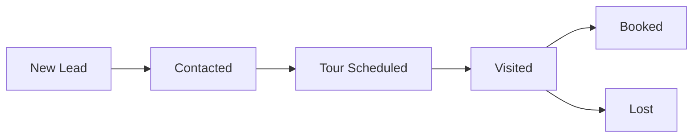
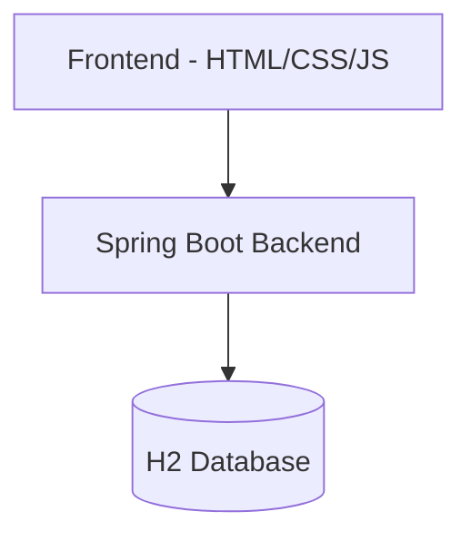

<h1 align="center">🚀 Gharpayy FlowOps CRM</h1>

<p align="center">
  <b>A Modern Lead Management CRM for PG Reservation Systems</b>
</p>

<p align="center">
  👨‍💻 Built by <b>Ravi Shankar Shukla</b>
</p>

<p align="center">
  <a href="https://gharpayy-flowops-crm.onrender.com">
    
  </a>
</p>

<p align="center">
  
  
  
  
</p>

---

## 📌 Overview

This is a **full-stack Lead Management CRM** designed for:

- 📥 Capturing leads  
- 🔄 Managing pipeline stages  
- 📅 Scheduling PG visits  
- 👤 Assigning ownership  
- 📊 Tracking dashboard metrics  

---

## 🌐 Live Demo

🔗 https://gharpayy-flowops-crm.onrender.com

---

## ✨ Features
## 📊 CRM Workflow



---

## 📊 System Architecture



---

## 📂 Project Structure

```
flowopscrm/
│── src/
│   ├── main/
│   │   ├── java/com/gharpayy/flowopscrm/
│   │   │   ├── controller/
│   │   │   ├── model/
│   │   │   ├── repository/
│   │   ├── resources/
│   │   │   ├── static/
│   │   │   ├── application.properties
│── Dockerfile
│── pom.xml
```

| Feature | Description |
|--------|------------|
| 📥 Lead Capture | Name, Phone, Location, Budget |
| 🔄 Pipeline | New → Contacted → Tour → Booked |
| 🌡 Temperature | Hot / Warm / Cold |
| 👤 Owner Assignment | Assign leads |
| 📅 Visit Scheduling | Schedule PG tours |
| 📊 Dashboard | Real-time lead count |
| ❌ Delete | Remove leads |

---

---

